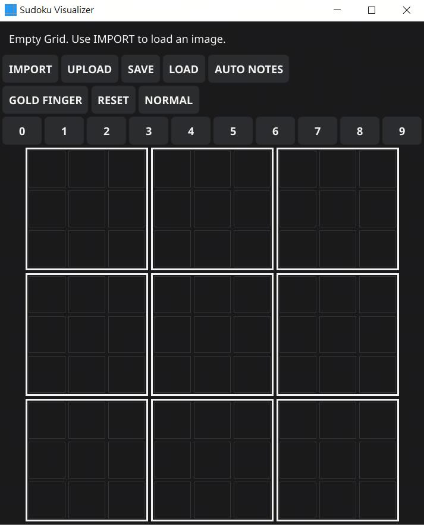
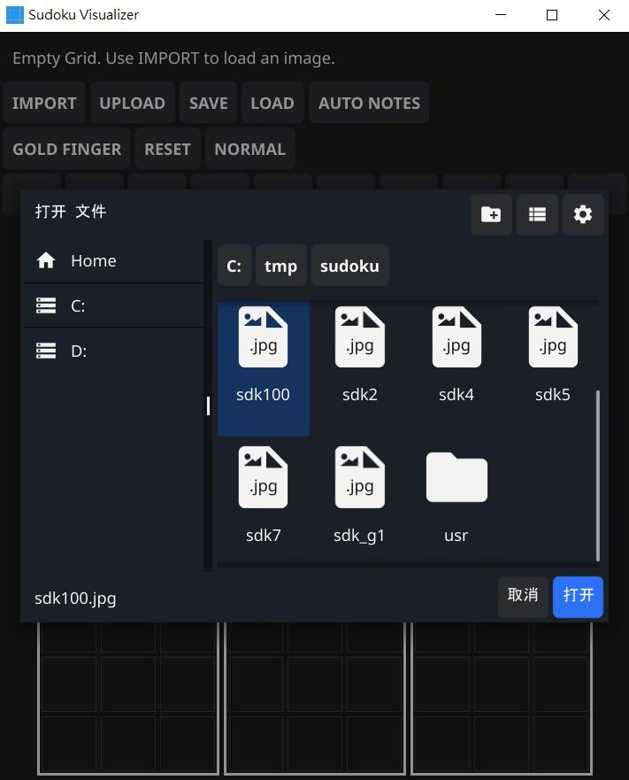
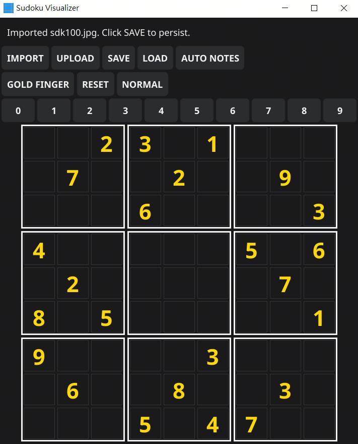
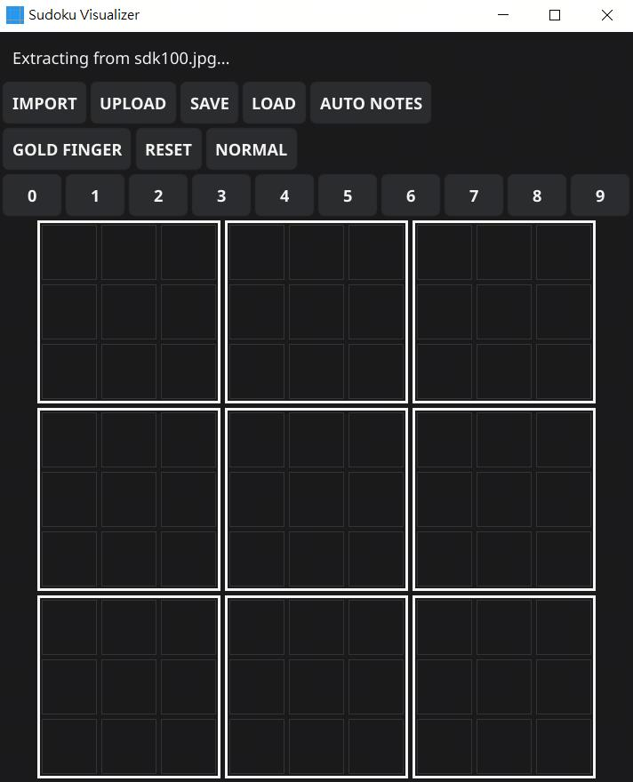
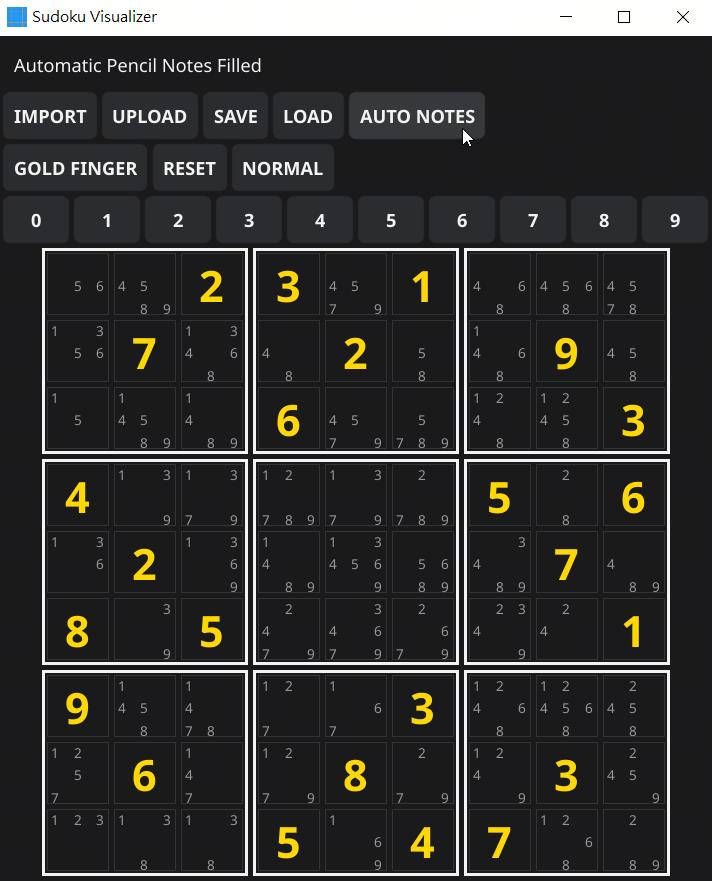
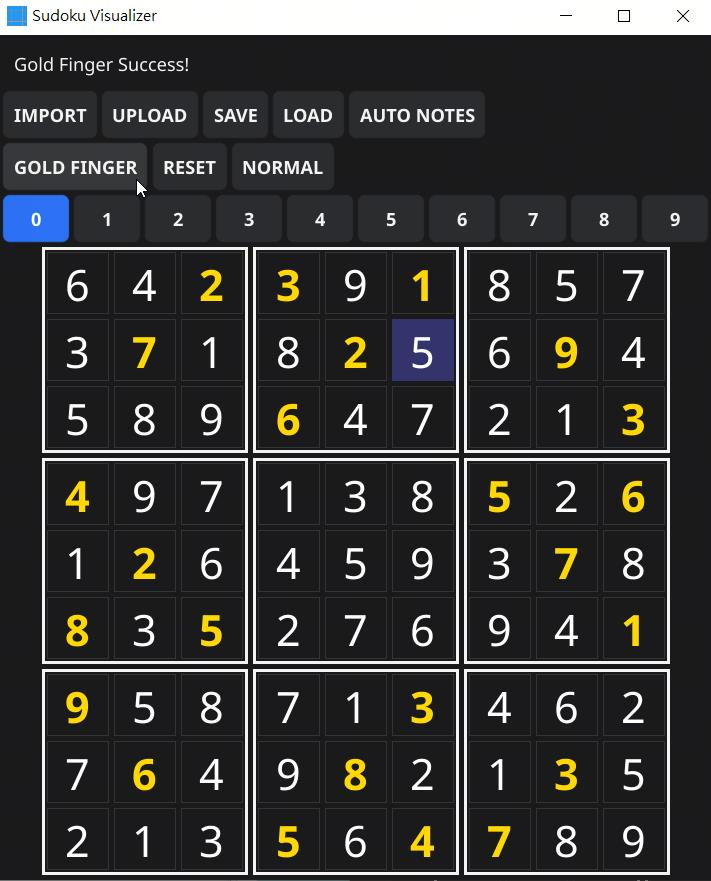
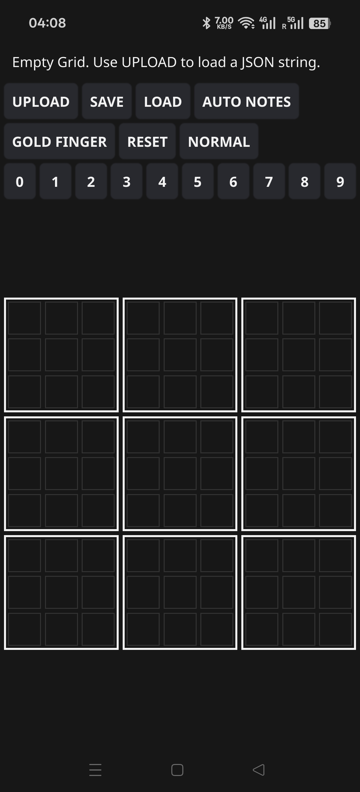
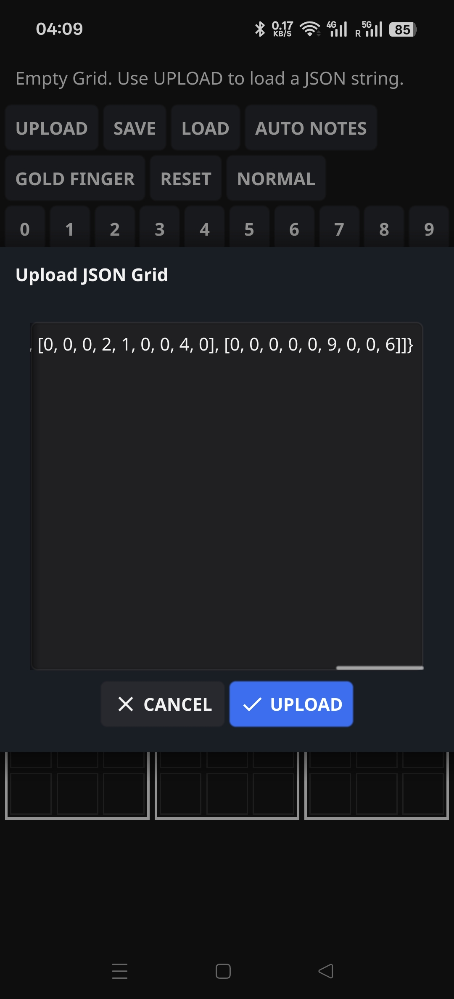
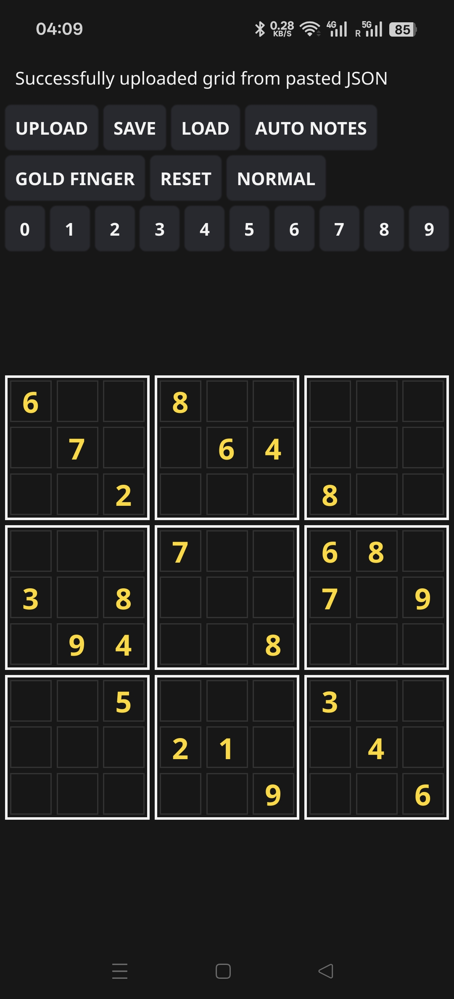
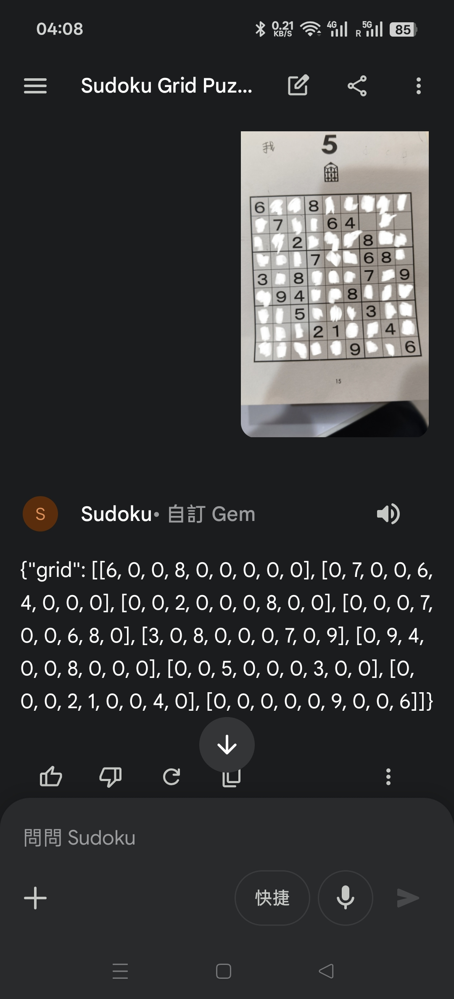

# Sudoku Helper

A Golang toolkit to extract Sudoku grids from screenshots and solve them via a feature-rich, interactive GUI.

## Features
- **AI Extraction**: Uses Gemini CLI (Gemini 3 models) to convert Sudoku screenshots into digital grids with high accuracy.
- **Interactive GUI**: Built with Fyne, featuring a responsive, touch-friendly layout with hover effects and borderless selection.
- **Recursive MRV Solver**: A deterministic, instant AI solver using the Minimum Remaining Values (MRV) heuristic.
- **Multi-Platform Support**: Linux (x86_64/ARM64), Windows (static, console-less), and Android (ARM64).
- **Automatic Notes**: Intelligent pencil-mark management based on Sudoku rules.
- **Input Modes**: Toggle between **NORMAL** and **NOTES** (pencil marks) via a dedicated button or the **'N'** key.
- **UPLOAD (Web AI Integration)**: Paste JSON strings directly from tools like ChatGPT or Gemini.
- **Fluent Navigation**: Full keyboard support (0-9, Arrows, Backspace/Delete). Navigation works even on locked clue cells.

## Screenshots
### Desktop (Windows/Linux)
| Startup | Image Selection | Image Preview |
| :---: | :---: | :---: |
|  |  |  |

| Importing | Auto Notes | Puzzle Solved |
| :---: | :---: | :---: |
|  |  |  |

### Android & Web AI Integration
| Android Startup | JSON Upload | Rendered Grid |
| :---: | :---: | :---: |
|  |  |  |

| AI Extraction (Gemini) |
| :---: |
|  |

## Requirements
- Go 1.21+
- Fyne-cross (for multi-platform/Android builds)
- Gemini CLI v0.33.2+ (for high-accuracy image extraction with Gemini 3 models)

## Build Instructions (via WSL/Linux)
### Linux (Native/WSL)
```bash
NPROC=$(nproc); GOMAX=$((NPROC > 2 ? NPROC - 2 : 1)); go build -v -p $GOMAX -o sudoku_helper_linux visualize.go bundled.go
```

### Windows (Cross-compile via Mingw-w64)
```bash
NPROC=$(nproc); GOMAX=$((NPROC > 2 ? NPROC - 2 : 1)); GOOS=windows GOARCH=amd64 CGO_ENABLED=1 CC=x86_64-w64-mingw32-gcc go build -v -p $GOMAX -ldflags="-s -w -extldflags=-static -H=windowsgui" -o sudoku_helper.exe visualize.go bundled.go
```

### ARM64 Linux (via Fyne-cross)
```bash
fyne-cross linux --arch=arm64 --icon=Icon.png --name=sudoku_helper_arm64_static --app-id=com.gemini.sudoku --ldflags="-extldflags=-static" .
```

### Android (via Fyne-cross)
```bash
fyne-cross android --arch=arm64 --icon=Icon.png --name=SudokuHelper --app-id=com.gemini.sudoku .
```

## Usage
1. Launch the application.
2. **Desktop:** Use **IMPORT** to load a grid from a local screenshot (requires Gemini CLI).
3. **Web AI / Mobile:** Upload an image to ChatGPT/Gemini Web and use this prompt:
   > ACT AS A SUDOKU SCANNER. Extract the 9x9 grid from this image. Return ONLY a JSON object: {"grid": [[...],[...],...]}. Zero (0) for empty cells. CRITICAL: Every row MUST have exactly 9 numbers. NO MARKDOWN. NO CHAT.
4. Click **UPLOAD** in the app and paste the JSON string.
5. Toggle input mode using the **NORMAL/NOTES** button or press **'N'**.
6. Use **Arrow Keys** to move across the board (including locked cells).
7. Use **GOLD FINGER** for an instant solution.

## Troubleshooting
- **Windows File Picker Logs:** You may see "Error getting file attributes" in the console when browsing the `C:` root. These are harmless library logs from Fyne and do not affect functionality.
- **Gemini Extraction:** Ensure your Gemini CLI is logged in and using Gemini 3 models for the best results.

## License
MIT License
