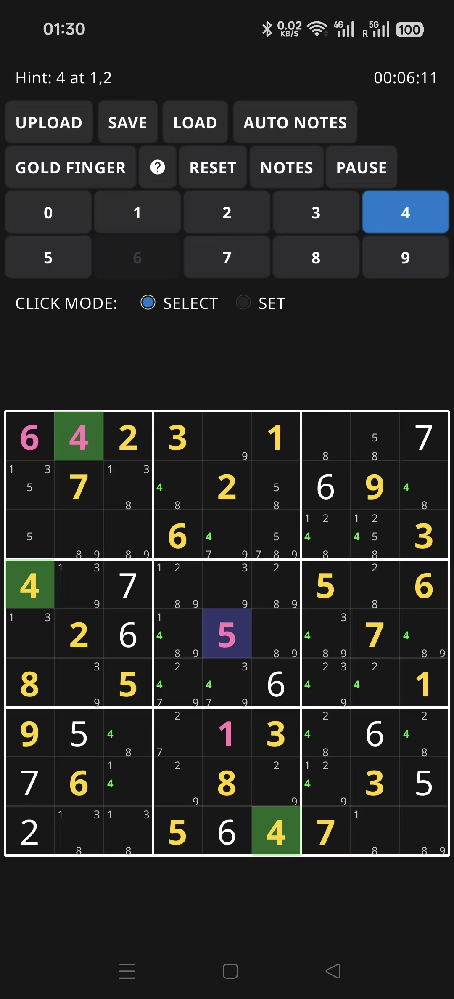
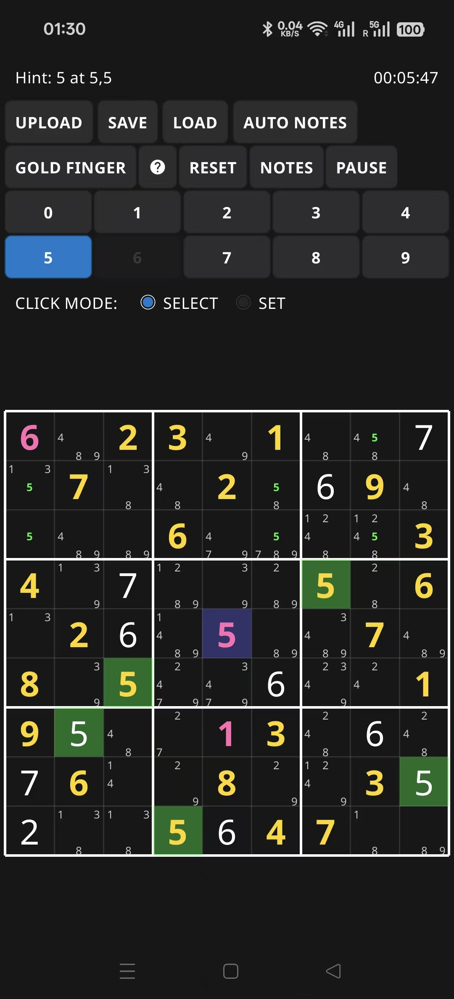
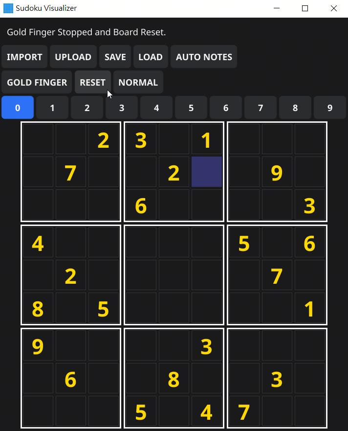
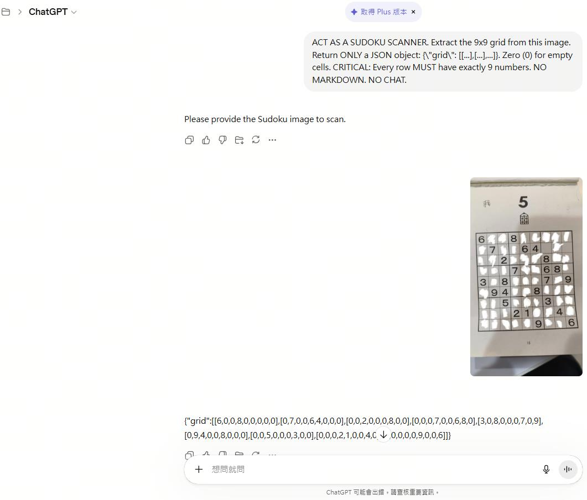

# Sudoku Helper

A high-performance Golang toolkit for extracting Sudoku grids from screenshots and solving them via a feature-rich, interactive GUI. Built with the Fyne framework, it offers a seamless experience across Desktop (Windows/Linux) and Mobile (Android).

## Core Features

### 🤖 AI-Powered Extraction
- **Image-to-Grid (Desktop)**: Uses the **Gemini CLI** to scan Sudoku screenshots and convert them into digital grids with near-perfect accuracy via the **IMPORT** button.
- **Web AI Integration (UPLOAD)**: Directly paste JSON strings generated by LLMs like ChatGPT or Gemini into the app to instantly populate the board.
- **Recommended Prompt**: 
  > ACT AS A SUDOKU SCANNER. Extract the 9x9 grid from this image. Return ONLY a JSON object: {"grid": [[...],[...],...]}. Zero (0) for empty cells. CRITICAL: Every row MUST have exactly 9 numbers. NO MARKDOWN. NO CHAT.

### 🧩 Intelligent Solving & Assistance
- **Gold Finger (Full Solver)**: A high-performance, deterministic solver using the **Minimum Remaining Values (MRV)** heuristic. It solves even the most complex puzzles instantly.
- **Raise Hand (Single Hint)**: Stuck on a move? The "Raise Hand" feature identifies the next logical step and places a single digit. 
  - **Visual Cue**: Hinted cells flash **Light Yellow** (RGB: 255, 255, 100) and the digit is permanently marked in **Bold Pink** (RGB: 255, 105, 180) for easy tracking.
- **Auto Notes**: Automatically manages pencil marks (candidates) for all empty cells based on current board rules.

### 🎮 Dynamic Interaction Modes
- **SELECT Mode**: Standard navigation; click to focus a cell and use keyboard/number pad input.
- **SET Mode (Stamping)**: Pre-select a digit to enter "Stamp Mode." Clicking any empty cell instantly places that digit—perfect for rapid filling.
- **NOTES Toggle**: Quickly switch between entering final digits and pencil marks via the GUI button or the **'N'** keyboard shortcut.
- **Power User Shortcuts**:
  - **Right-Click / Long-Press**: Instantly "stamp" the currently highlighted digit into any cell using the current mode (**NORMAL** or **NOTES**).
  - **Arrow Keys**: Fluidly navigate the 9x9 grid.

### 🌈 Advanced Visual Feedback
- **Conflict Highlighting**: Invalid moves trigger a 1-second **Red Flash** on conflicting cells, preventing illegal placements.
- **Digit Scanning & Note Tracking**: 
  - Tapping any filled cell highlights all occurrences of that digit in **Vibrant Light Green** (RGB: 39, 245, 63).
  - Corresponding pencil marks (notes) for the scanned digit are also highlighted, making candidate tracking effortless.
- **Dynamic Buttons**: Number buttons automatically gray out and disable once a digit has been placed 9 times on the board.

### 🛠️ Professional Tooling
- **Integrated Timer**: Track your solving speed with a high-precision, pauseable timer that stops automatically upon completion.
- **Compact & High-DPI Ready**:
  - Features a custom **Compact Dark Theme** for maximum screen real estate.
  - **Manual Scaling**: Use the `--scale=X` flag (e.g., `--scale=1.5`) to override system DPI settings.
- **Multi-Platform Consistency**: 
  - **Windows/Linux**: Static, console-less builds with native file dialogs.
  - **Android**: Specialized file management with an **OVERWRITE** vs. **NEW FILE** workflow to bypass SAF limitations, ensuring reliable Save/Load functionality.

---

## Screenshots

### 🖥️ Desktop Experience (Windows / Linux)
| Startup & UI | Image Selection | AI Rendering |
| :---: | :---: | :---: |
|  |  |  |

| AI Extraction | Auto Notes | Solution (Gold Finger) |
| :---: | :---: | :---: |
|  |  |  |

### 💡 Smart Hints & Logic
| Hint: Next Empty | Hint: Selected Cell | Reset Logic |
| :---: | :---: | :---: |
|  |  |  |

### 📱 Mobile & Web Integration (Android)
| Android Startup | JSON Upload | Rendered Grid |
| :---: | :---: | :---: |
|  |  |  |

| LLM Prompting (ChatGPT) | LLM Prompting (Gemini) |
| :---: | :---: |
|  |  |

---

## Technical Specs
- **Engine**: Go 1.23.0
- **GUI Framework**: Fyne v2.7.3
- **External Dependency**: [Gemini CLI](https://github.com/google/gemini-cli) (required for the **IMPORT** feature).
- **Architecture**: 20-rectangle grid layout for artifact-free rendering and debounced resizing.
- **Deployment**: 
  - Windows (`SudokuHelper.exe`)
  - Linux (`SudokuHelper`)
  - Android (`SudokuHelper.apk`)

## Usage

### Command Line
Run with a saved JSON grid file to load it immediately:
```bash
./SudokuHelper savegame.json
```
Apply manual UI scaling (useful for High-DPI displays):
```bash
./SudokuHelper --scale=2.0
```

### In-App Workflow
1. **Desktop:** Click **IMPORT** to select a Sudoku screenshot (requires Gemini CLI installed and configured).
2. **Mobile/Web:** Upload your screenshot to an LLM (ChatGPT/Gemini), copy the JSON grid, and click **UPLOAD** in the app.
3. **Solving:** Toggle between **NORMAL** and **NOTES** mode (or press **'N'**). Use **GOLD FINGER** if you want the full solution or **Raise Hand** for a single hint.
4. **Saving:** Use the **SAVE** button to persist your progress to a JSON file.

## Troubleshooting
- **Right-click on Windows/Linux:** Ensure a cell is selected first if the standard right-click is not responsive, or try a brief long-press.
- **Android Save Issues:** Use the **OVERWRITE** button when replacing existing files to avoid native SAF limitations.
- **Gemini Extraction:** Ensure your Gemini CLI is logged in and using the latest Gemini models for the best results.

---
*Developed with ❤️ for Sudoku enthusiasts.*
